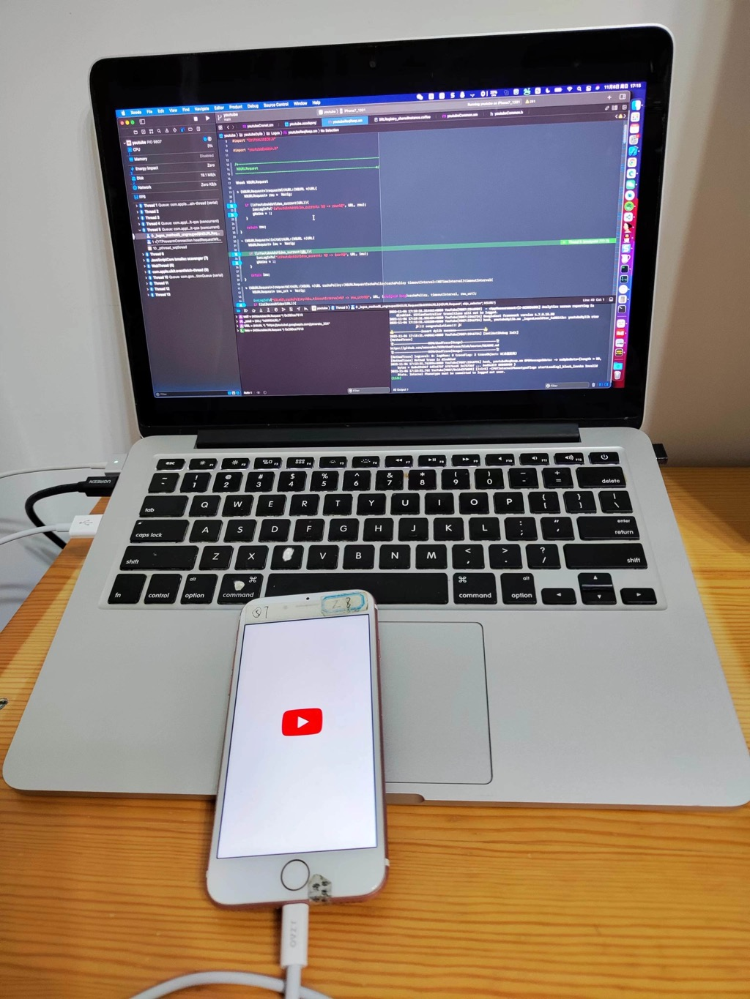

# iOSYouTubeAdsFilter=iOS版YouTube广告过滤

最后更新：`20221106`

## 项目仓库

https://github.com/crifan/iOSYouTubeAdsFilter

`git clone https://github.com/crifan/iOSYouTubeAdsFilter.git`

## 项目功能

[XCode](https://book.crifan.org/books/xcode_dev_summary/website/)+[MonkeyDev](https://book.crifan.org/books/ios_re_monkeydev_debug/website/)的项目代码，用于[iOS逆向YouTube](https://book.crifan.org/books/ios_re_youtube_reverse/website/)，尝试实现YouTube的广告过滤

## 如何使用

* 环境
  * 系统: `Mac`
    * `Xcode`
  * 设备：`已越狱iPhone`
* 打开项目
  * 双击`youtube.xcodeproj`，即可打开Xcode项目
* Xcode中每次调试
  * 先Clean：`Product`->`Clean Build Folder`
  * 再调试：点击启动按钮▶️，即可自动安装`YouTube`和开始调试`YouTube`
    * 调试效果
      * 
        * 

## 说明

## 代码说明

* `youtubeDylib/Logos`：所有hook代码逻辑都在这里
  * 公共的部分
    * `youtubeCommon.xm`
    * `youtubeCommon.h`
  * 各个部分的hook
    * `youtubeCronet.xm`
    * `youtubeDataLoadTask.xm`
    * `youtubeDylib.xm`
    * `youtubeError.xm`
    * `youtubeHAM.xm`
    * `youtubeML.xm`
    * `youtubeReqResp.xm`
      * 其中有最常见的入口函数
        * 网络相关
          * 请求request
            * `NSURLRequest`
              * `initWithURL`
              * `requestWithURL`
          * 响应response
            * `NSHTTPURLResponse`
              * `initWithURL`
              * 一些属性
                * `allHeaderFields`
                * `statusCode`
    * `youtubeTimer.xm`
* `libs`：相关的，自己写的，库函数
  * `c`：C语言的
  * `iOS`：iOS语言的

## 其他说明

* `result`：之前调试和研究追踪YouTube广告过滤期间的输出成果
  * `youtubeCallSequence.coffee`：相关函数调用逻辑
    * 包括最早的，从播放时间为0的角度追踪的相关函数逻辑
    * 和后续的，加了header导致死循环重复触发请求等相关逻辑
  * `functions`：涉及到的个别的部分的函数的IDA伪代码
  * `disable_ads_filter/disable_ads_filter_logic.coffee`：和广告过滤=禁止广告相关的函数调用逻辑

## 其他相关

其他相关说明解释，详见：

[YouTube广告过滤相关 · iOS逆向开发：YouTube逆向 (crifan.org)](https://book.crifan.org/books/ios_re_youtube_reverse/website/re_yt_output/yt_ads_filter/)
